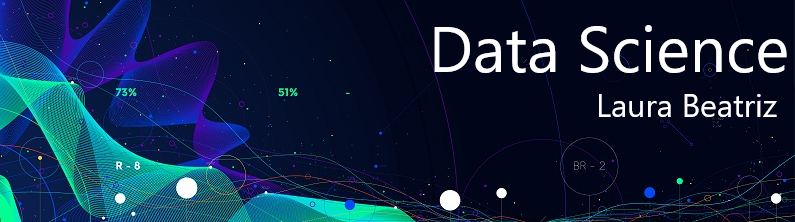

 

  

# Laura Beatriz
*Data Scientist* at Tokio Marine

I am currently a data scientist at Tokio Marine, focusing on digital transformations with artificial intelligence (AI) and machine learning (ML).

Computer Science student at FMU (Faculdades Metropolitanas Unidas), where I also act as a student ambassador, facilitating communication between the coordination and the student body, and collaborating in the solution of any problems.

https://github.com/labeah 

**Background in:** Python, AWS, IBM Cloud e DataRobot.

**Links:**
* [Blog](https://www.instagram.com/data_scientist.py/)
* [LinkedIn](https://www.linkedin.com/in/laura-martins-dev/)

## Project:

* **Airbnb, Berlim:** Colab: https://bit.ly/2zhLak6 | GitHub: https://bit.ly/2XMERyr
* **Análise de dados de violência, Rio de Janeiro:** Colab: https://bit.ly/3ducfyz | GitHub: https://bit.ly/3evmfZD

---

